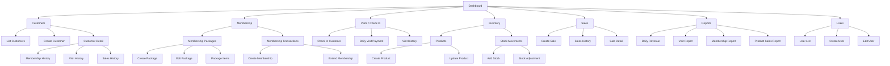

```mermaid
flowchart TD

A[Dashboard]

A --> B[Customers]
A --> C[Membership]
A --> D[Visits / Check In]
A --> E[Inventory]
A --> F[Sales]
A --> G[Reports]
A --> H[Users]

%% CUSTOMER
B --> B1[List Customers]
B --> B2[Create Customer]
B --> B3[Customer Detail]
B3 --> B4[Membership History]
B3 --> B5[Visit History]
B3 --> B6[Sales History]

%% MEMBERSHIP
C --> C1[Membership Packages]
C1 --> C2[Create Package]
C1 --> C3[Edit Package]
C1 --> C4[Package Items]

C --> C5[Membership Transactions]
C5 --> C6[Create Membership]
C5 --> C7[Extend Membership]

%% VISITS
D --> D1[Check In Customer]
D --> D2[Daily Visit Payment]
D --> D3[Visit History]

%% INVENTORY
E --> E1[Products]
E1 --> E2[Create Product]
E1 --> E3[Update Product]

E --> E4[Stock Movements]
E4 --> E5[Add Stock]
E4 --> E6[Stock Adjustment]

%% SALES
F --> F1[Create Sale]
F --> F2[Sales History]
F --> F3[Sale Detail]

%% REPORT
G --> G1[Daily Revenue]
G --> G2[Visit Report]
G --> G3[Membership Report]
G --> G4[Product Sales Report]

%% USERS
H --> H1[User List]
H --> H2[Create User]
H --> H3[Edit User]
```