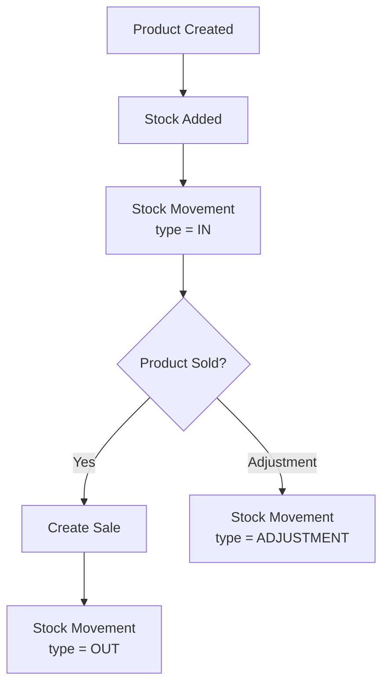

```mermaid
flowchart TD

A[Product Created]

A --> B[Stock Added]

B --> C[Stock Movement<br>type = IN]

C --> D{Product Sold?}

D -->|Yes| E[Create Sale]

E --> F[Stock Movement<br>type = OUT]

D -->|Adjustment| G[Stock Movement<br>type = ADJUSTMENT]
```