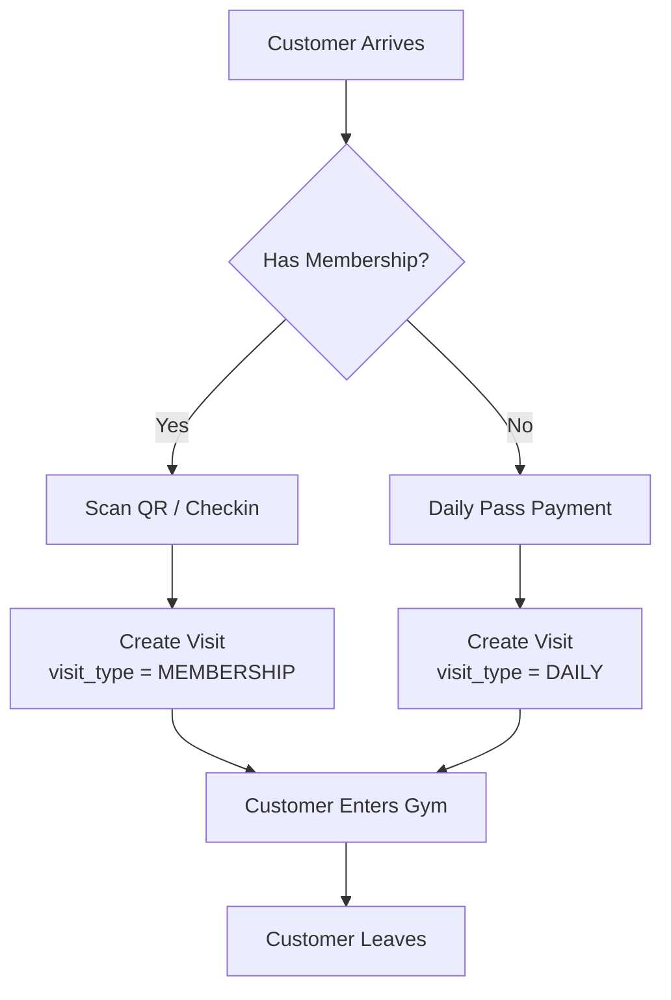

```mermaid
flowchart TD

A[Customer Arrives]

A --> B{Has Membership?}

B -->|Yes| C[Scan QR / Checkin]
C --> D[Create Visit<br>visit_type = MEMBERSHIP]

B -->|No| E[Daily Pass Payment]
E --> F[Create Visit<br>visit_type = DAILY]

D --> G[Customer Enters Gym]
F --> G

G --> H[Customer Leaves]
```